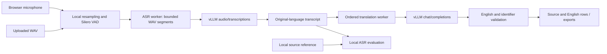

# vLLM-Hosting v1

The Linux Streamlit process uses local CPU Silero VAD and existing remote model
instances. A conversation owns an immutable ASR configuration, one selected fast
translation profile, a glossary snapshot, and their endpoint clients.

ASR publication invokes a session-bound callback outside its lock. It submits
new source rows directly to translation, so browser polling only displays
results. Upload Futures survive UI reruns; their completion callback runs before
the result is published. Both paths preserve source order and local timestamps.

Endpoint clients omit request deadlines and transport retries. Translation may
perform one content repair for invalid English or missing protected identifiers.
The queue exposes manual retry for failures. Replacing a conversation clears
pending work, closes clients, and discards late results. Stop microphone input
drains accepted segments; it differs from replacing/cancelling the conversation.

Responses must have valid complete final text. Reasoning fields are not consumed,
unparsed thinking markup is rejected, and tool calls/refusals/truncation remain
errors. The translator receives bounded conversation and terminology context;
evaluation references are not model inputs. Rendering and caption exports
independently protect the English-only contract.

Speaker diarization, provider comparison, and both correction passes are deferred
on this branch. The full previous implementation is preserved on
`OpenAI-Translation-Updates`. This client does not claim streaming ASR partials,
source separation, model accuracy, or production latency/capacity guarantees.
